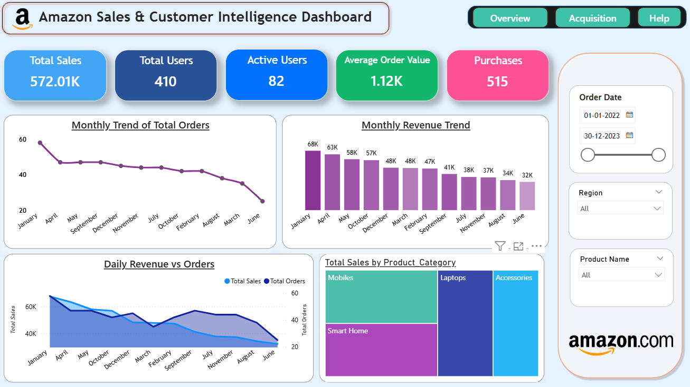
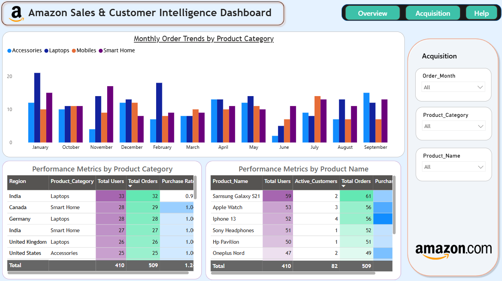
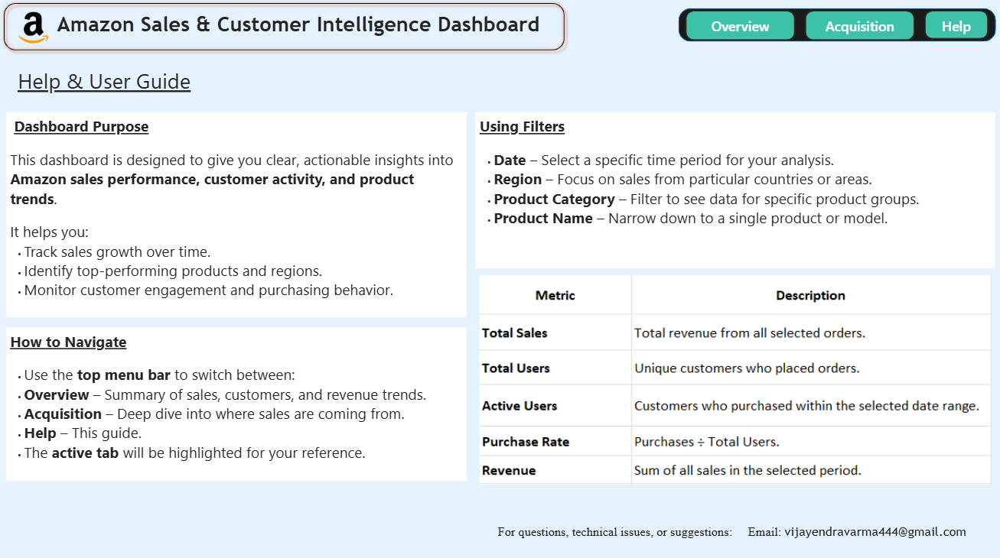

#  Amazon Sales & Customer Intelligence Dashboard

##  Project Overview
This project is a **multi-page Power BI analytics solution** built to transform Amazon sales transaction data into **clear, actionable insights** for business decision-making.  
It demonstrates end-to-end capability — from **data preparation and modeling** to **interactive visualization design** — with a strong focus on **storytelling, usability, and decision support**.

The dashboard is structured into three purpose-driven tabs:
- **Overview** – Executive KPIs, sales trends, and category performance at a glance.
- **Acquisition** – Deep-dive into product and category performance metrics.
- **Help** – Embedded user documentation for intuitive onboarding.

---

##  Business Value
A well-designed analytics dashboard is not just about charts — it’s about **enabling the right decisions at the right time**.  
This solution delivers:
- **Clarity** – Highlights key revenue drivers and customer engagement trends.
- **Speed** – Allows stakeholders to filter and drill down without analyst intervention.
- **Accuracy** – Data-driven KPIs designed to support performance reviews and strategy planning.

---

##  Skills & Tools Applied
- **Power BI** – Data modeling, DAX measures, page navigation, and responsive design.
- **Data Analysis** – KPI definition, segmentation, trend analysis, and performance benchmarking.
- **UI/UX for Analytics** – Gradient navigation bar, active state indicators, and layout consistency.
- **Data Preparation** – Cleaning and structuring transactional data for optimal BI performance.

---

##  Key Metrics & Insights
**KPIs Tracked:**
- Total Sales  
- Total Users  
- Active Users  
- Average Order Value  
- Purchases  
- Purchase Rate  

**Insights Delivered:**
- Seasonal revenue patterns and sales peaks.
- Top-selling product categories and high-performing regions.
- Customer engagement metrics to support retention strategies.

---

##  Dashboard Preview

### **Overview Tab**

### **Acquisition Tab**

### **Help Tab**

---

##  Dataset
Data sourced from cleaned Amazon sales transaction records, containing:
- Order details (date, ID, customer ID)  
- Product information (name, category)  
- Region, quantity, unit price, and ratings  

---

##  Contact
**Author:** Samudrala Vijayendra Varma  
 **Email:** [vijayendravarma444@gmail.com](mailto:vijayendravarma444@gmail.com)  
 **LinkedIn:** [Vijayendra Varma Samudrala](https://www.linkedin.com/in/vijayendra-varma-samudrala-13b4a828a/)  
 **GitHub:** [vijayendravarma111](https://github.com/vijayendravarma111)  

---

## 🏷 Tags
`#PowerBI` `#BusinessIntelligence` `#DataAnalytics` `#DataVisualization` `#DAX` `#DashboardDesign` `#AnalyticsEngineering`
