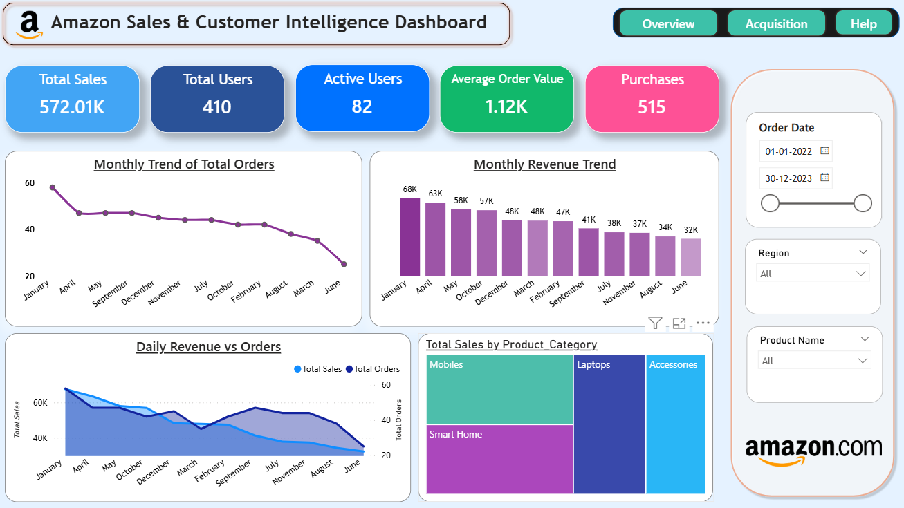
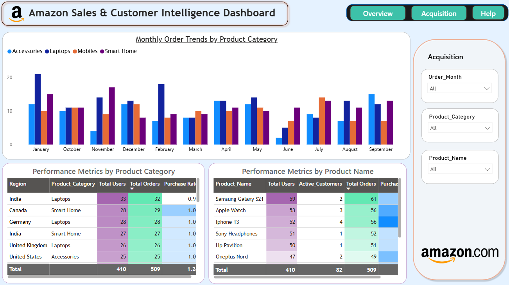
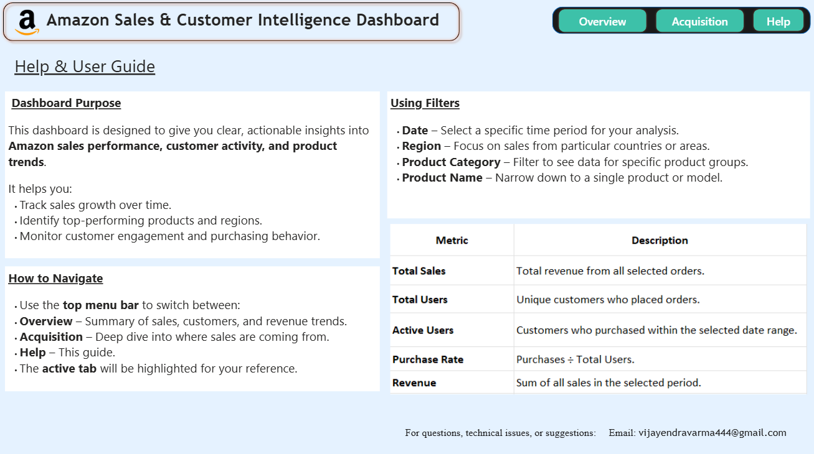

# Amazon Sales and Customer Intelligence Dashboard

## Overview

This project is a multi-page Power BI dashboard built to analyze Amazon sales data and present insights in a simple and useful way.

The focus is on turning raw transaction data into clear business insights that help understand sales performance, customer behavior, and product trends.

---

## Dashboard Structure

The dashboard is divided into three sections:

- Overview  
  Shows key metrics, overall sales trends, and category performance  

- Acquisition  
  Focuses on product-level and category-level performance  

- Help  
  Provides guidance on how to use the dashboard  

---

## Business Value

This dashboard helps in:

- Understanding revenue trends and performance  
- Identifying top-performing products and categories  
- Tracking customer activity and engagement  
- Making faster decisions using interactive filters  

---

## Key Metrics

- Total Sales  
- Total Users  
- Active Users  
- Average Order Value  
- Total Purchases  
- Purchase Rate  

---

## Insights

- Sales show clear seasonal trends  
- A few categories contribute most of the revenue  
- Customer activity varies across regions  
- Engagement metrics help identify growth opportunities  

---

## Dashboard Preview

### Overview



---

### Acquisition



---

### Help



---

## Dataset

The dataset includes:

- Order details (date, order ID, customer ID)  
- Product details (name, category)  
- Region and quantity  
- Pricing and ratings  

Both raw and cleaned datasets are included in the project.

---

## Tools Used

- Power BI for dashboard creation  
- DAX for calculated measures  
- Data cleaning and preparation  

---

## Project Structure

``` id="amz82p"
Amazon-Sales-Dashboard/
│
├── Dataset/
│   ├── Uncleaned_Amazon_Sales_Dataset.csv
│   ├── cleaned_Amazon_Sales_Dataset.xlsx
│
├── Results/
│   ├── Acquisition.png
│   ├── Help.png
│   ├── Overview.png
│
├── README.md

```
## Use Cases
Sales performance analysis
Customer behavior understanding
Product performance tracking
Business reporting and dashboards


## Author

Samudrala Vijayendra Varma

Email: vijayendravarma444@gmail.com

LinkedIn: https://www.linkedin.com/in/vijayendra-varma-samudrala-13b4a828a/

GitHub: https://github.com/vijayendravarma111
